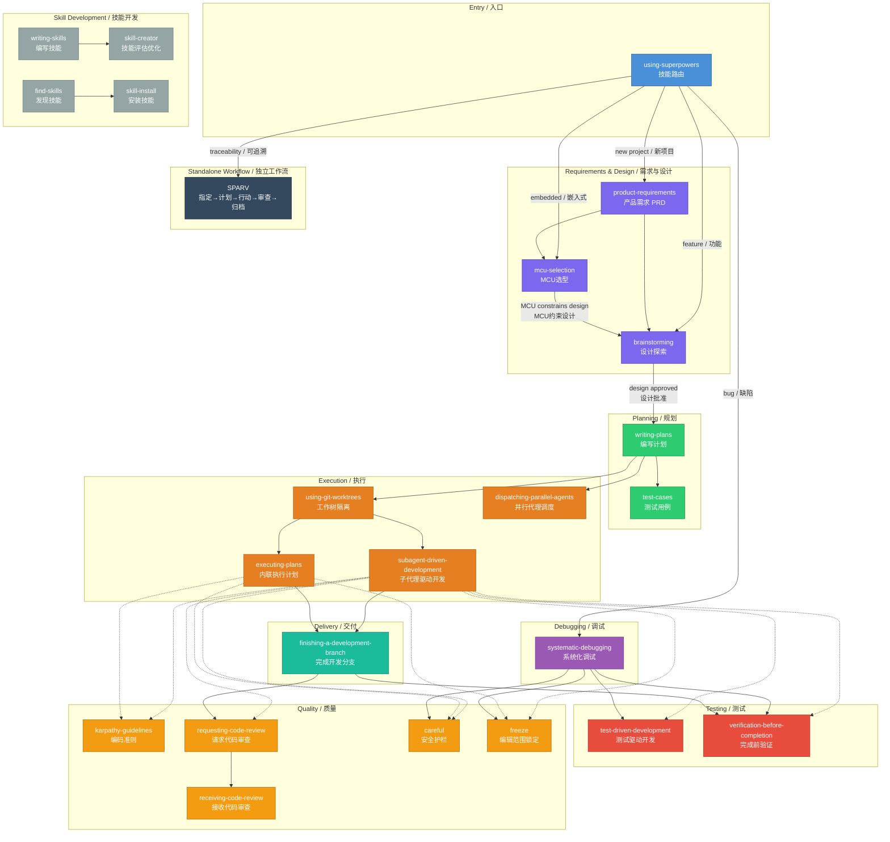

# Claude Code Skills Guide / Claude Code 技能集指南

A curated collection of 24 skills for Claude Code, adapted from [obra/superpowers](https://github.com/obra/superpowers) with the plugin framework removed. These skills form a structured workflow for software development — from requirements gathering to implementation, debugging, and delivery.

本技能集包含 24 个 Claude Code 技能，改编自 [obra/superpowers](https://github.com/obra/superpowers)，移除了插件框架。这些技能构成了从需求分析到实现、调试和交付的完整开发工作流。

---

## Skill Categories / 技能分类

### 1. Entry Point / 入口

| Skill | Description | 说明 |
|-------|-------------|------|
| **using-superpowers** | Session entry point and skill router. Routes to appropriate skills based on task type. | 会话入口和技能路由器。根据任务类型路由到对应技能。 |

### 2. Requirements & Design / 需求与设计

| Skill | Description | 说明 |
|-------|-------------|------|
| **product-requirements** | Interactive Product Owner with 100-point quality scoring. Generates PRD at score ≥90. | 交互式产品负责人，100 分制质量评分，≥90 分生成 PRD。 |
| **brainstorming** | Collaborative design exploration. One question at a time, proposes 2-3 approaches. HARD GATE: no code before design approval. | 协作式设计探索。逐个提问，提出 2-3 种方案。硬性门槛：设计批准前不写代码。 |
| **mcu-selection** | MCU selection from 284+ database (SiLabs, GigaDevice, Fudan Micro, WCH, XHSC). | 从 284+ 数据库中选择 MCU（芯科、兆易创新、复旦微、沁恒、小华）。 |

### 3. Planning / 规划

| Skill | Description | 说明 |
|-------|-------------|------|
| **writing-plans** | Converts specifications into step-by-step implementation plans with 2-5 min tasks. | 将规格说明转换为逐步实施计划，每项任务 2-5 分钟。 |
| **test-cases** | Generates structured test cases from PRD/requirements. Bridges requirements → testing. | 从 PRD/需求生成结构化测试用例。连接需求与测试。 |

### 4. Execution / 执行

| Skill | Description | 说明 |
|-------|-------------|------|
| **subagent-driven-development** | Executes plans with fresh subagent per task + two-stage review (spec compliance + code quality). | 每个任务委派新子代理执行，双重审查（规格合规 + 代码质量）。 |
| **executing-plans** | Alternative inline execution with batch checkpoints. Lighter weight than SDD. | 替代的内联执行方式，带批量检查点。比子代理驱动更轻量。 |
| **dispatching-parallel-agents** | Runs 2+ independent tasks in parallel with separate subagents. | 使用独立子代理并行运行 2+ 个独立任务。 |

### 5. Testing / 测试

| Skill | Description | 说明 |
|-------|-------------|------|
| **test-driven-development** | RED → GREEN → REFACTOR. Iron Law: no code without failing test first. | 红→绿→重构。铁律：没有失败测试就不写代码。 |
| **verification-before-completion** | MANDATORY before claiming done. Runs verification commands and confirms output. | 完成前强制验证。运行验证命令并确认输出。 |

### 6. Quality Assurance / 质量保证

| Skill | Description | 说明 |
|-------|-------------|------|
| **karpathy-guidelines** | Coding quality: think before code, simplicity, surgical changes, verifiable criteria. | 编码质量：先思考后编码，简洁，精准修改，可验证的标准。 |
| **requesting-code-review** | Gets code review before merging. Works with subagent-driven per-task review. | 合并前获取代码审查。配合子代理驱动的逐任务审查。 |
| **receiving-code-review** | Processes code review feedback with technical rigor before implementing. | 在实施前以技术严谨性处理代码审查反馈。 |
| **careful** | Safety guardrails for destructive commands. Signals: flash, erase, fuse, force-push. | 破坏性命令的安全护栏。信号词：烧录、擦除、熔丝、强制推送。 |
| **freeze** | Restricts file edits to a specific directory. Especially valuable in embedded debugging. | 将文件编辑限制在特定目录。在嵌入式调试中特别有价值。 |

### 7. Debugging / 调试

| Skill | Description | 说明 |
|-------|-------------|------|
| **systematic-debugging** | Structured bug investigation: freeze scope → careful → TDD → verify. NEVER skip on bugs. | 结构化缺陷调查：锁定范围→谨慎→TDD→验证。遇到缺陷绝不跳过。 |

### 8. Delivery / 交付

| Skill | Description | 说明 |
|-------|-------------|------|
| **using-git-worktrees** | Creates isolated git worktrees for feature work. Required before SDD or executing-plans. | 为功能开发创建隔离的 git 工作树。SDD 和执行计划的前置要求。 |
| **finishing-a-development-branch** | Implementation done → verify tests → present merge/PR options → clean up. | 实现完成→验证测试→提供合并/PR 选项→清理。 |

### 9. Skill Development / 技能开发

| Skill | Description | 说明 |
|-------|-------------|------|
| **writing-skills** | TDD for process docs: write failing test → write skill → refactor. | 过程文档的 TDD：写失败测试→写技能→重构。 |
| **skill-creator** | Create, evaluate, benchmark, and optimize skills. Complements writing-skills. | 创建、评估、基准测试和优化技能。与 writing-skills 互补。 |
| **skill-install** | Install skills from GitHub with automated security scanning. | 从 GitHub 安装技能，带自动安全扫描。 |
| **find-skills** | Discover and install new skills from the open skills ecosystem. | 从开放技能生态中发现和安装新技能。 |

### 10. Workflow / 工作流

| Skill | Description | 说明 |
|-------|-------------|------|
| **sparv** | SPARV: Specify → Plan → Act → Review → Vault. Structured task execution with journaling. | SPARV：指定→计划→行动→审查→归档。带日志的结构化任务执行。 |

---

## Workflow Diagram / 工作流程图



---

## Workflow Routes / 工作流路径

### Route 1: New Project / 新项目（完整流程）

```
using-superpowers → product-requirements → brainstorming (+ mcu-selection if embedded)
→ writing-plans → test-cases → using-git-worktrees → subagent-driven-development
→ requesting-code-review → finishing-a-development-branch
```

### Route 2: Feature Development / 功能开发

```
using-superpowers → brainstorming → writing-plans → using-git-worktrees
→ subagent-driven-development → finishing-a-development-branch
```

### Route 3: Bug Fix / 缺陷修复

```
using-superpowers → systematic-debugging (→ freeze → careful)
→ test-driven-development → verification-before-completion
```

### Route 4: Embedded Project / 嵌入式项目

```
using-superpowers → product-requirements → mcu-selection → brainstorming
→ writing-plans → subagent-driven-development (with careful + freeze)
→ finishing-a-development-branch
```

### Route 5: Quick Traceability / 快速追溯

```
/sparv → Specify → Plan → Act → Review → Vault
```

---

## Cross-Cutting Skills / 横切技能

These skills are invoked by other skills at specific points, not triggered directly:

以下技能在特定场景下被其他技能调用，不直接触发：

| Skill | Invoked By | When / 何时调用 |
|-------|-----------|----------------|
| **freeze** | systematic-debugging, subagent-driven-development, executing-plans | Before editing — lock scope to fault module or task directory / 编辑前锁定范围到故障模块或任务目录 |
| **careful** | systematic-debugging, subagent-driven-development, finishing-a-development-branch | Before destructive ops: flash, erase, fuse, force-push / 破坏性操作前：烧录、擦除、熔丝、强制推送 |
| **karpathy-guidelines** | subagent-driven-development, executing-plans, systematic-debugging | During implementation — ensures quality principles / 实现过程中确保质量准则 |
| **verification-before-completion** | TDD, systematic-debugging, subagent-driven-development, finishing-a-development-branch | Before claiming done/fixed/passing / 完成前必须验证 |
| **requesting-code-review** | subagent-driven-development (per task), finishing-a-development-branch | After implementation, before merge / 实现后合并前 |
| **test-driven-development** | systematic-debugging (Phase 4), subagent-driven-development | Writing fix or feature code / 编写修复或功能代码 |
